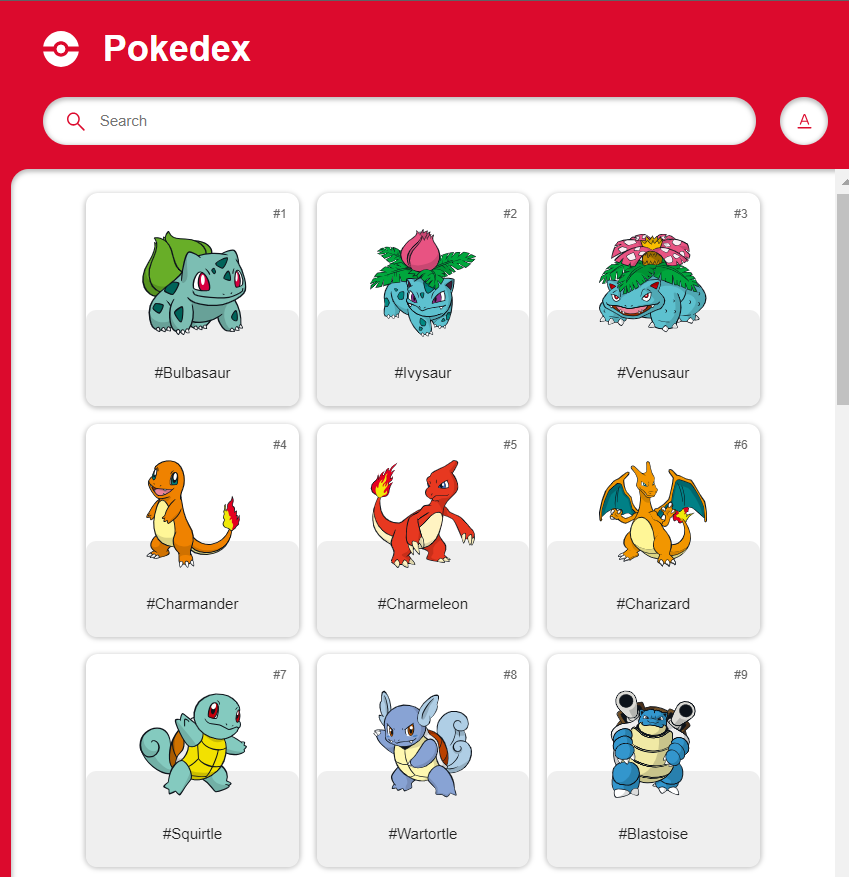
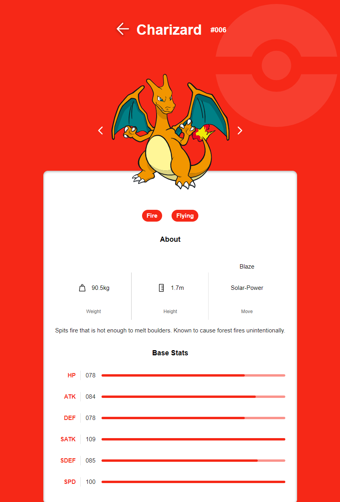

## Pokedex App

 

Pokemon app to show details of selected pokemon. Search bar enabled with name and number search references.
Pokemon details are pulled from the API pokeapi.

Link to site: https://n-townsend.github.io/Pokedex/

## Technologies Used

- Javascript
- jQuery
- HTML
- CSS

## Design Inpiration

https://www.figma.com/community/file/979132880663340794/pokedex